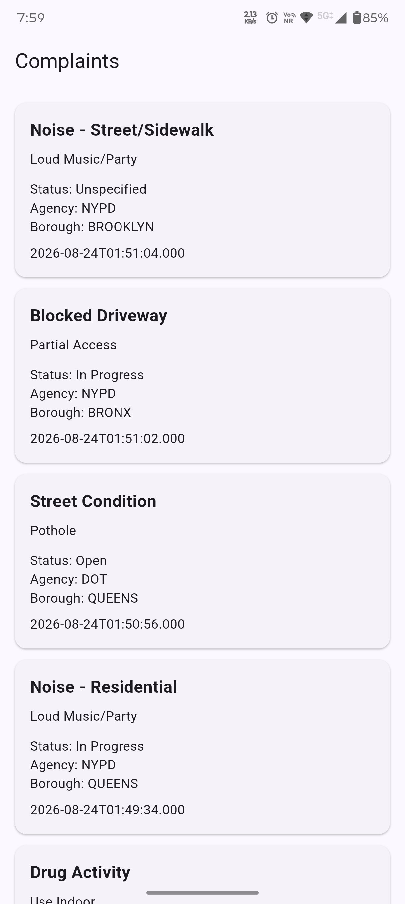
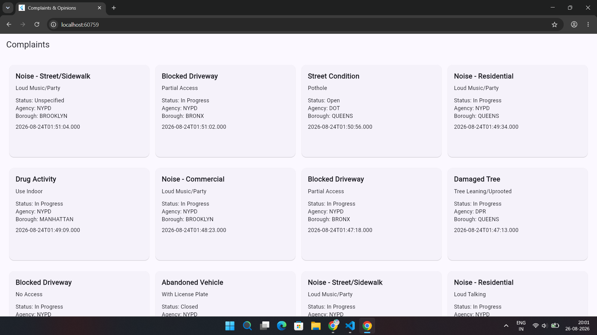

# API Integration Practice

A Flutter practice project focused on integrating a public REST API and displaying the data in a simple mobile and web interface.

The project uses the NYC 311 Open Data API to fetch complaint data.

## What I Practiced

- REST API integration
- HTTP requests
- Service and repository layers
- Cubit for state management
- Loading and error states
- Separate layouts for mobile and web
- Reusable Flutter widgets

## Packages Used

- flutter_bloc - Used Cubit for managing the application state
- http - Used to make API requests

## API Used

NYC 311 Open Data API

For this project, I fetch 20 complaints from the API and display them in the app.

The basic data flow is:

API → Service → Repository → Cubit → UI

## Screenshots

### Mobile

### Web

## UI

The UI is kept simple because the main focus of this project was learning API integration and understanding how the different layers work together.
